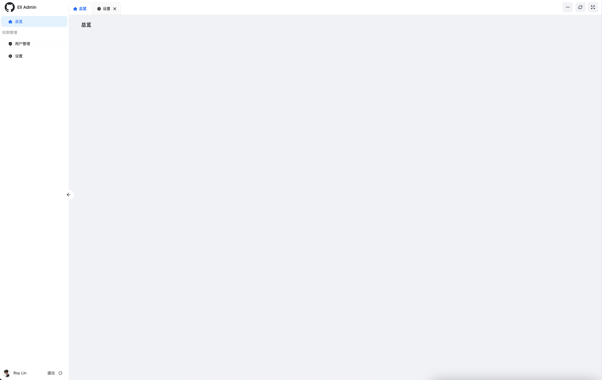

# Ell Admin

## 项目简介

基于 Ant Design 的多标签页后台管理模板。



## 技术选型

- **前端框架**：[React](https://react.dev/) - 一个用于构建用户界面的 JavaScript 库，提供高效的组件化开发体验。
- **路由系统**：[React Router](https://reactrouter.com/) - 一个功能强大的前端路由库，支持声明式路由配置和动态路由加载。
- **UI组件**：[Ant Design](https://ant.design/) - 企业级UI设计语言和React UI库。
- **构建工具**：[Rsbuild](https://rsbuild.dev/) - 一个基于Rust开发的高效构建工具，支持现代前端开发的最佳实践。
- **状态管理**：[Valtio](https://valtio.dev/) - 一个轻量级、易于使用的状态管理库，支持高效的跨组件状态共享。
- **授权认证**：[CASL](https://casl.js.org/) - 一个功能强大的访问控制库，支持前后端同构的细粒度权限管理。

## 安装运行

### 环境准备

1. **Node.js**：确保你已经安装了 Node.js（建议版本 >= 20.0.0）。
2. **pnpm**：安装 pnpm（一个快速的 Node.js 包管理工具），你可以通过 npm 或 yarn 安装它。

### 安装模板

1. **克隆项目**：
   ```bash
   git clone git@github.com:elljs/antd.git ell
   ```
   这将把项目克隆到你的本地目录中，并命名为 `ell`。

2. **安装依赖**：
   ```bash
   cd ell
   pnpm i
   ```
   进入项目目录并安装所有依赖包。

### 开发模式

1. **启动开发服务器**：
   ```bash
   pnpm dev
   ```
   运行该命令将启动开发服务器，你可以在浏览器中访问 [http://localhost:8888/](http://localhost:8888/) 进行预览。

### 生产构建

1. **构建项目**：
   ```bash
   pnpm build
   ```
   运行该命令将进行生产环境的构建，生成的文件将位于 `dist` 目录中。

2. **部署**：将 `dist` 目录中的文件部署到你的服务器上即可。

## 开源协议

本项目遵循 MIT 开源协议，你可以自由地使用、修改和分发这个项目。详细信息请参考 [LICENSE](LICENSE) 文件。

## 社区与支持

- **GitHub 仓库**：[https://github.com/elljs/antd](https://github.com/elljs/antd)
- **问题追踪**：在 GitHub 仓库中提交 issue 或 pull request。
- **文档与示例**：查看项目文档和示例代码，了解如何更好地使用 Ell Admin。

我们欢迎任何形式的贡献和反馈，感谢你的关注和支持！